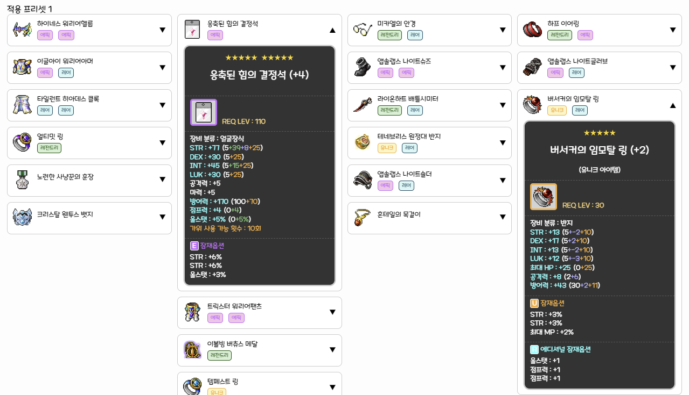
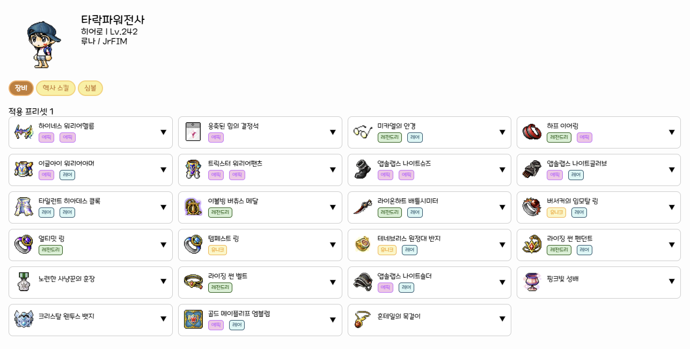

# 🛠️ 패치 노트 v0.0.5

**📅 배포일**: 2025/04/10

---

### 🧰 캐릭터 장비 정보창 개선

- **장비 상세 정보창 크기 통일**  
  기존에는 장비 상세 정보창의 크기가 아이템에 따라 다르게 표시되어 UI가 불안정하게 보이는 문제가 있었습니다.  
  이제 모든 장비의 상세 정보창이 동일한 크기로 고정되어, 보다 깔끔한 UI를 제공합니다.

- **공백 발생 문제 수정**  
  상세 정보를 확인할 때 해당 줄에 불필요한 공백이 생기던 문제를 해결하였습니다.  
  상세 정보가 열릴 때 해당 아이템 칸만 높이가 증가하도록 조정하여, 다른 아이템 확인에 방해되지 않도록 개선하였습니다.

  - 수정 예시
    

- **예시 캐릭터 정보 출력 추가**  
  캐릭터 정보창에 예시 데이터로 **타락파워전사**의 정보가 출력되도록 설정하였습니다.  
  이 기능은 테스트 및 미리보기용으로, 차후 제거될 수 있습니다.
  

### 📄 패치 노트 목록 개선

- **패치 노트 목록 페이지네이션 추가**  
  `/patch_notes` 경로에서 모든 패치 노트를 한 번에 불러오는 방식에서, 페이지당 5개씩만 표시되도록 페이지네이션 기능을 도입하였습니다.  
  이를 통해 더 많은 패치 노트가 누적되어도 쾌적하게 확인할 수 있습니다.

- **패치 노트 상세 페이지 하단에 목록 연동**  
  특정 버전의 패치 노트를 보고 있을 때, 하단에 전체 패치 노트 목록을 페이지네이션 형태로 함께 볼 수 있도록 구성하였습니다.  
  이를 통해 사용자는 패치 노트를 열람하면서 다른 버전의 기록도 바로 확인할 수 있습니다.
